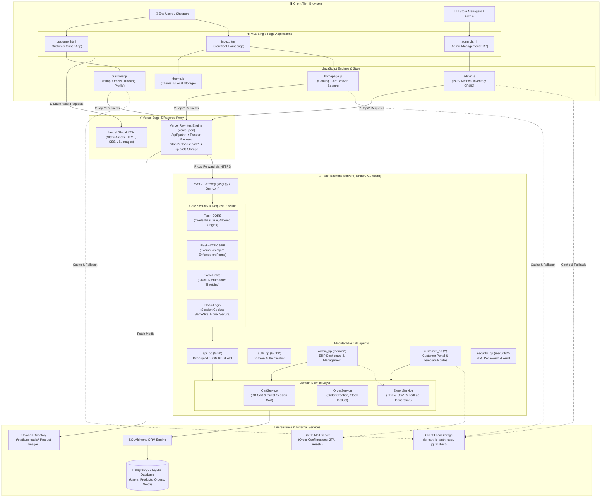
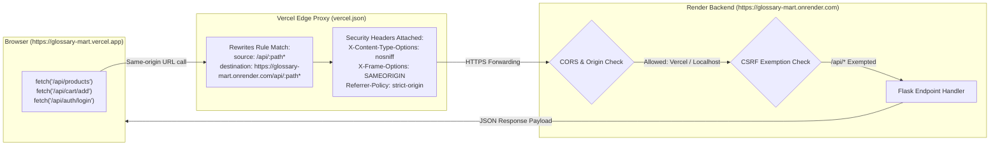
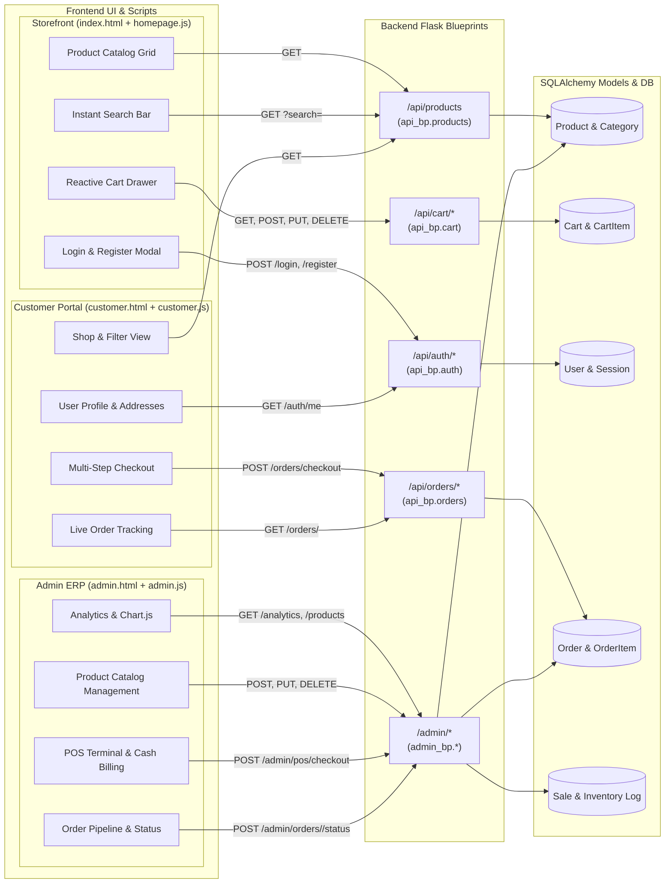
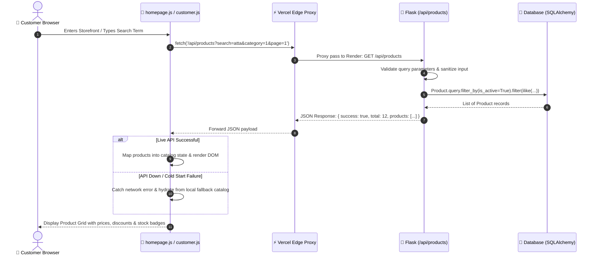
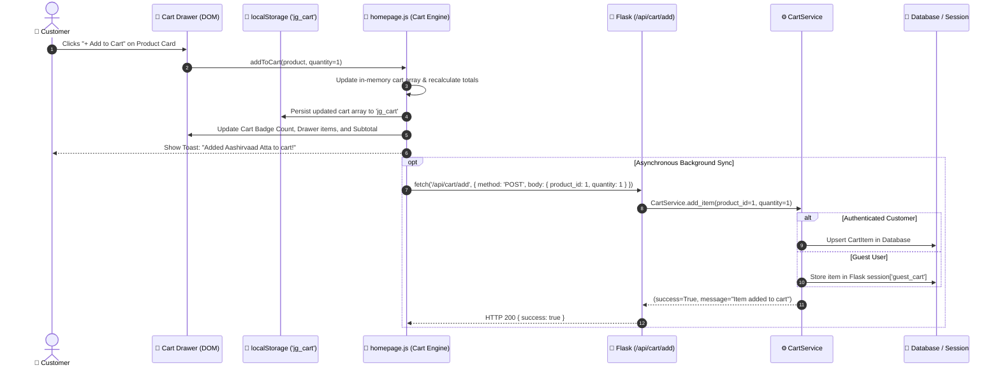
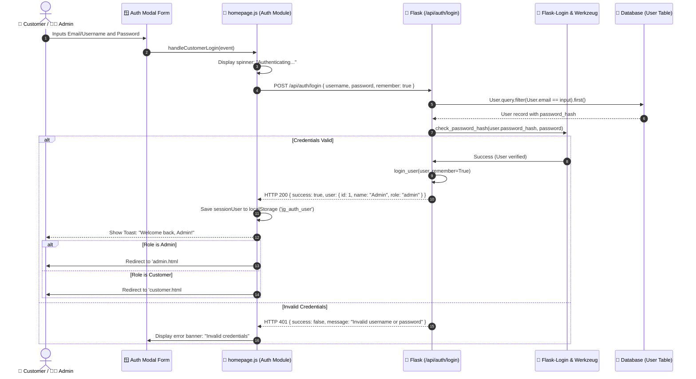
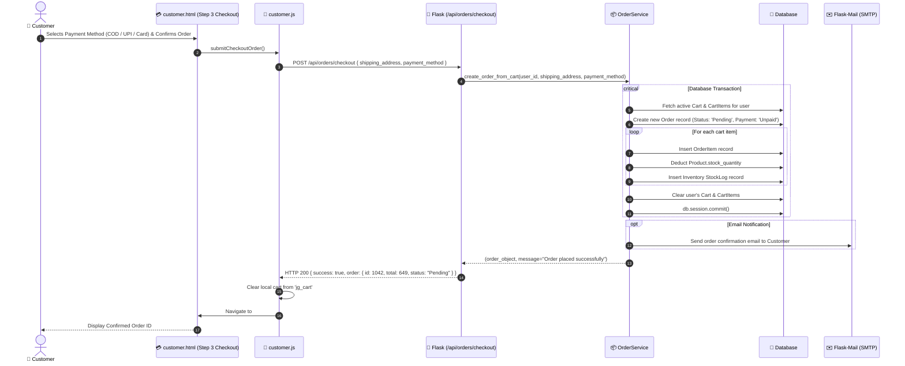
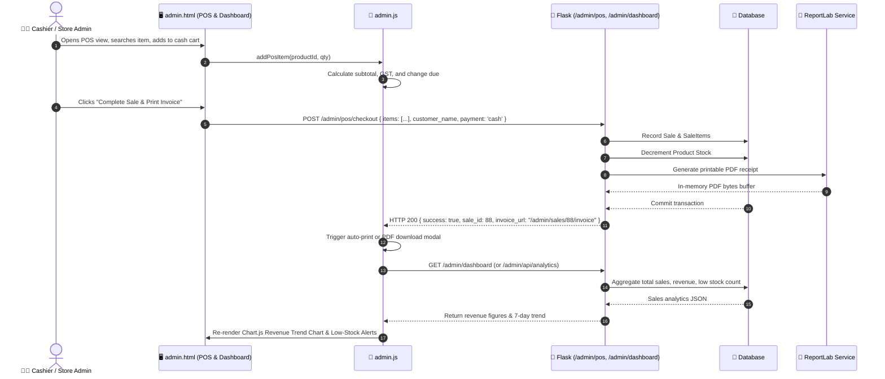
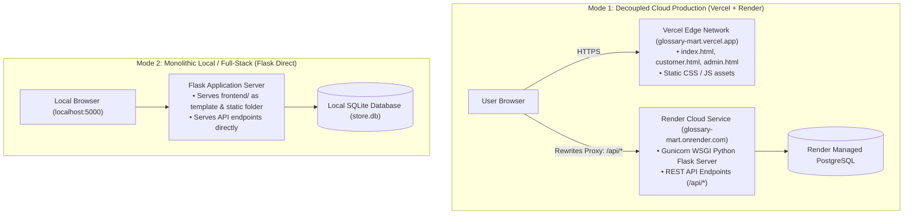
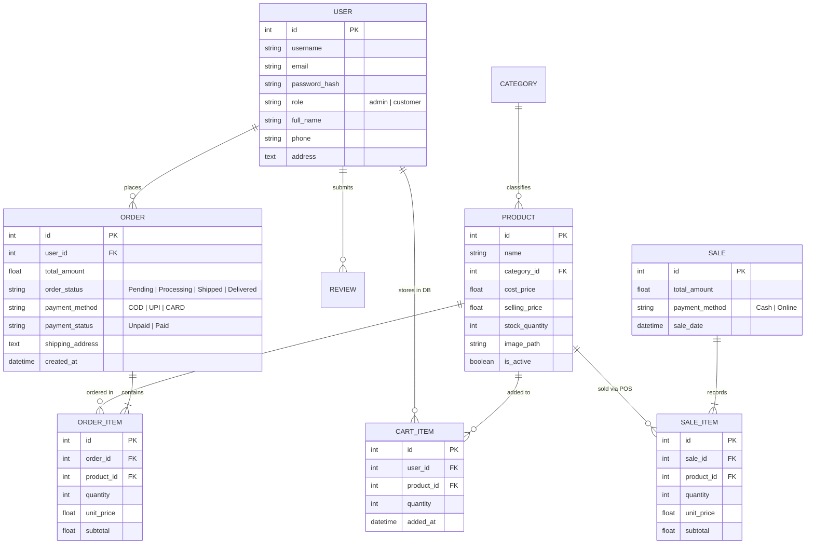

# 🌐 Frontend & Backend Architecture & Connection Graph

> **Project:** e Grossary (E-Commerce & Retail ERP)  
> **Repository:** `d:/mart/mart`  
> **Tech Stack:** Vanilla JavaScript (ES6+), Bootstrap 5, Python Flask, Flask Blueprints, SQLAlchemy ORM, PostgreSQL / SQLite, Vercel Edge CDN, Render Cloud WSGI.

---

## 📑 Table of Contents
1. [High-Level System Architecture](#1-high-level-system-architecture)
2. [Network, Gateway & Proxy Flow](#2-network-gateway--proxy-flow)
3. [Client-Side UI to Backend Blueprint Mapping](#3-client-side-ui-to-backend-blueprint-mapping)
4. [End-to-End Sequence Diagrams](#4-end-to-end-sequence-diagrams)
   - [A. Product Catalog Browsing & Search Flow](#a-product-catalog-browsing--search-flow)
   - [B. Reactive Cart Synchronization Flow](#b-reactive-cart-synchronization-flow)
   - [C. User Authentication Flow](#c-user-authentication-flow)
   - [D. Checkout & Order Fulfillment Pipeline](#d-checkout--order-fulfillment-pipeline)
   - [E. Admin ERP Dashboard & POS Terminal Flow](#e-admin-erp-dashboard--pos-terminal-flow)
5. [Complete API & Route Contract Reference](#5-complete-api--route-contract-reference)
6. [Deployment Topology & Dual-Mode Operation](#6-deployment-topology--dual-mode-operation)
7. [Database Entity Relationship & Data Sync](#7-database-entity-relationship--data-sync)
8. [Summary of Connection Mechanisms](#8-summary-of-connection-mechanisms)

---

## 1. High-Level System Architecture

The application operates in a **decoupled hybrid architecture** where the client presentation layer is hosted on Vercel's global Edge CDN, while the Python Flask application and relational database are hosted on Render Cloud.

---

## 2. Network, Gateway & Proxy Flow

The connection between the client browser and the backend server uses **transparent reverse-proxying** to avoid cross-origin friction while supporting direct cross-origin access during development.

---

## 3. Client-Side UI to Backend Blueprint Mapping

This graph maps the frontend user interfaces and scripts to their corresponding Flask routes, service classes, and database models.

---

## 4. End-to-End Sequence Diagrams

### A. Product Catalog Browsing & Search Flow
How `homepage.js` and `customer.js` fetch active inventory with category filtering, search queries, and fallback to local state.

---

### B. Reactive Cart Synchronization Flow
How adding an item updates the UI instantly, stores state in `localStorage`, and asynchronously syncs with the Flask session/database.

---

### C. User Authentication Flow
Customer or Admin login flow supporting decoupled JSON credentials and session cookie persistence.

---

### D. Checkout & Order Fulfillment Pipeline
Full end-to-end checkout flow from customer confirmation to backend transaction and inventory reduction.

---

### E. Admin ERP Dashboard & POS Terminal Flow
Point-of-Sale (POS) counter transaction and real-time Chart.js dashboard metrics synchronization.

---

## 5. Complete API & Route Contract Reference

| Frontend Feature | Client Caller | HTTP | Backend Route | Blueprint / Handler | Response Type | Description |
| :--- | :--- | :--- | :--- | :--- | :--- | :--- |
| **Catalog Feed** | `homepage.js` / `customer.js` | `GET` | `/api/products` | `api_bp.get_products` | `JSON` | Paginated product list with search, category & price filters |
| **Product Detail** | `customer.js` | `GET` | `/api/products/<id>` | `api_bp.get_product_detail` | `JSON` | Full details, stock level, ratings, and customer reviews |
| **View Cart** | `homepage.js` / `customer.js` | `GET` | `/api/cart` | `api_bp.get_cart` | `JSON` | Current items, quantities, subtotal & free shipping progress |
| **Add to Cart** | `homepage.js` / `customer.js` | `POST` | `/api/cart/add` | `api_bp.add_to_cart` | `JSON` | Add product to session or DB cart |
| **Update Cart** | `customer.js` | `PUT` | `/api/cart/update` | `api_bp.update_cart` | `JSON` | Update quantity of cart line item |
| **Remove Item** | `homepage.js` / `customer.js` | `DELETE`| `/api/cart/remove` | `api_bp.remove_from_cart` | `JSON` | Delete single item from cart |
| **Clear Cart** | `customer.js` | `DELETE`| `/api/cart/clear` | `api_bp.clear_cart` | `JSON` | Empty entire cart |
| **User Profile** | `homepage.js` / `customer.js` | `GET` | `/api/auth/me` | `api_bp.get_current_user` | `JSON` | Current authenticated session info |
| **User Login** | `homepage.js` (Auth Modal) | `POST` | `/api/auth/login` | `api_bp.api_login` | `JSON` | Authenticate customer/admin, issue session cookie |
| **Register** | `homepage.js` (Auth Modal) | `POST` | `/api/auth/register` | `api_bp.api_register` | `JSON` | Create new customer user account |
| **Logout** | Header UI | `POST` | `/api/auth/logout` | `api_bp.api_logout` | `JSON` | Destroy session & invalidate cookies |
| **List Orders** | `customer.js` (My Orders) | `GET` | `/api/orders` | `api_bp.get_orders` | `JSON` | Fetch past orders for logged in user |
| **Order Detail** | `customer.js` (Tracking) | `GET` | `/api/orders/<id>` | `api_bp.get_order_detail` | `JSON` | Line items and status progression of specific order |
| **Checkout** | `customer.js` (Checkout) | `POST` | `/api/orders/checkout` | `api_bp.api_checkout` | `JSON` | Turn cart into placed order, reduce stock |
| **Health Check** | Ping Monitor | `GET` | `/api/health` | `api_bp.api_health` | `JSON` | Backend status verification |
| **POS Billing** | `admin.js` (POS View) | `POST` | `/admin/pos/checkout` | `admin_bp.pos_checkout` | `JSON / PDF` | Record in-store sale & deduct inventory |
| **PDF Export** | `admin.js` (Reports) | `GET` | `/admin/sales/export/pdf` | `admin_bp.export_sales_pdf` | `Binary PDF` | ReportLab-generated sales statement |
| **Media Images** | `img` tags in DOM | `GET` | `/static/uploads/<filename>` | `app.uploaded_file` | `Image/JPEG/PNG`| Uploaded product image files |

---

## 6. Deployment Topology & Dual-Mode Operation

e Grossary is architected to operate smoothly in two distinct deployment modes without requiring code refactoring:

### Client-Side Graceful Degradation:
1. **Live Synchronization First**: On page load, `homepage.js`, `customer.js`, and `admin.js` initiate asynchronous `fetch('/api/products')` and `fetch('/api/cart')` calls.
2. **Cold-Start Protection**: If Render's free web service is spinning up from idle (cold-start delay ~30-50s) or offline, the JavaScript engines catch the promise rejection and smoothly fall back to client-side catalogs and `localStorage` caches.
3. **Session Rehydration**: Logged-in credentials are saved both in Flask's secure HTTP-only cookies and in `localStorage.setItem('jg_auth_user')`, ensuring UI state continuity even across page switches.

---

## 7. Database Entity Relationship & Data Sync

This diagram shows how backend models in `database/models/` map directly to the frontend's reactive state objects.

---

## 8. Summary of Connection Mechanisms

| Channel / Mechanism | Direction | Protocol / Transport | Security & Configuration |
| :--- | :--- | :--- | :--- |
| **Vercel Rewrites** | Client ➔ Render Backend | HTTPS Reverse Proxy | Configured in `vercel.json`; transparently bridges `/api/*` to Render |
| **Direct Fetch (CORS)** | Client ➔ Backend | HTTP/2 or HTTPS Fetch API | Configured with `flask_cors.CORS`, `supports_credentials=True`, origins whitelist |
| **Session Tracking** | Backend ⇄ Client | Secure HTTP-only Cookie | `SESSION_COOKIE_SAMESITE='None'`, `SESSION_COOKIE_SECURE=True` in production |
| **Local Client Storage** | JS ⇄ Browser Storage | Web Storage API | Stores cart (`jg_cart`), auth (`jg_auth_user`), theme (`jg_theme`) for zero-latency UI |
| **Static File Uploads** | Backend ➔ Client | HTTPS Static File Delivery | Endpoint `/static/uploads/<filename>` routed to physical disk storage folder |
| **Invoice / Data Export** | Backend ➔ Client | Streamed Binary / Blob | ReportLab PDF stream and CSV formatted downloads via `flask.send_file` |
