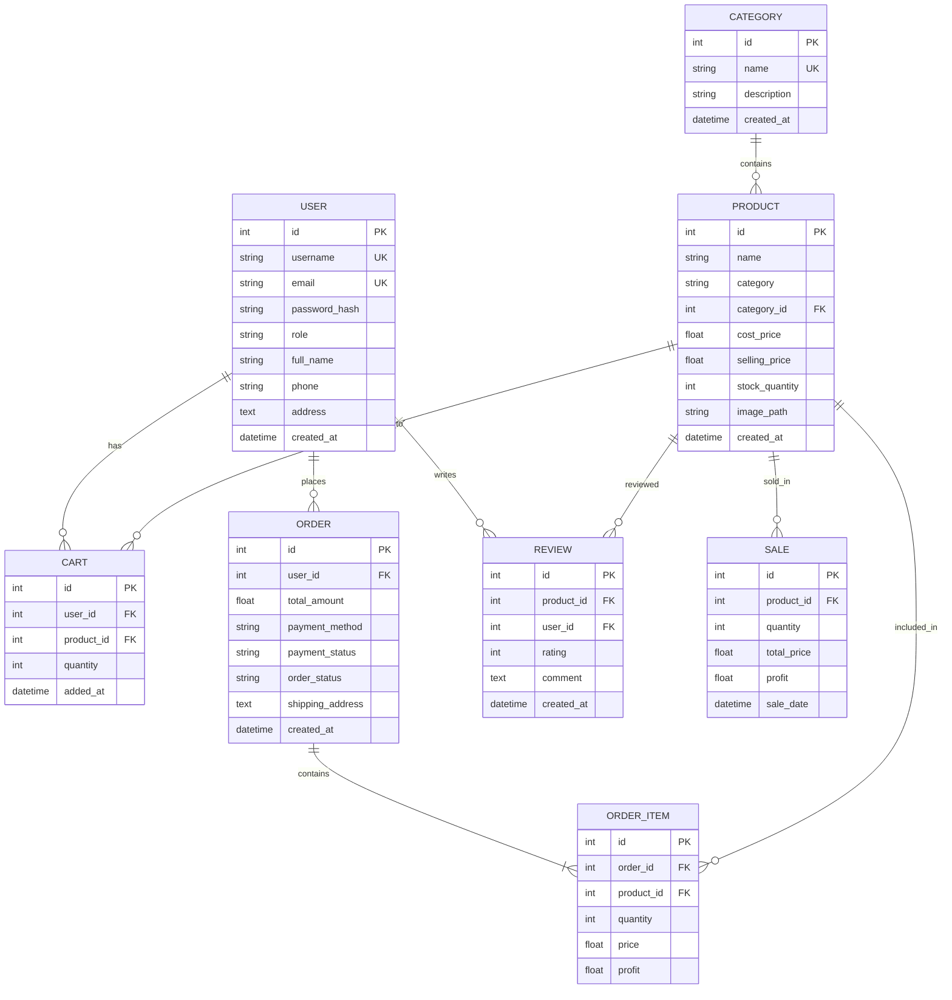

# 🛒 Jay Goga Kirana Store Management System

A full-featured **E-Commerce & Shop Management** web application built with Python Flask. It serves **two types of users** — **Admin** (shop owner) and **Customer** (online buyer) — with dedicated dashboards, product browsing, cart & checkout, order management, analytics, and more.

---

## 🚀 How to Run the Project

Follow these steps to get the application up and running on your local machine.

### Prerequisites

| Requirement | Version |
|---|---|
| Python | 3.8 or higher |
| pip | Latest recommended |
| Git | Optional (for cloning) |

### Step 1 — Clone or Download the Project

```bash
git clone <repository-url>
cd mart
```

Or simply navigate to the project folder:
```bash
cd d:\mart
```

### Step 2 — Create a Virtual Environment

```bash
python -m venv venv
```

### Step 3 — Activate the Virtual Environment

**Windows (PowerShell):**
```powershell
venv\Scripts\activate
```

**Windows (CMD):**
```cmd
venv\Scripts\activate.bat
```

**Linux / macOS:**
```bash
source venv/bin/activate
```

### Step 4 — Install Dependencies

```bash
pip install -r requirements.txt
```

This installs the following packages:

| Package | Purpose |
|---|---|
| Flask 3.0.0 | Web framework |
| Flask-SQLAlchemy 3.1.1 | Database ORM |
| Werkzeug 3.0.1 | Password hashing & utilities |
| python-dotenv 1.0.0 | Environment variable management |
| Flask-WTF 1.2.1 | CSRF protection & forms |
| WTForms 3.1.1 | Form validation |
| reportlab 4.0.7 | PDF generation for sales reports |
| Flask-Mail 0.10.0 | Email notifications |

### Step 5 — Configure Environment Variables (Optional)

Edit the `.env` file in the project root to customize settings:

```env
# Secret key for session management
SECRET_KEY=your-secret-key-change-this-in-production

# Database
DATABASE_URI=sqlite:///store.db

# Upload settings
UPLOAD_FOLDER=static/uploads
MAX_FILE_SIZE=5242880
ALLOWED_EXTENSIONS=png,jpg,jpeg,gif

# Default admin credentials (change after first login)
ADMIN_USERNAME=admin
ADMIN_PASSWORD=admin123
```

### Step 6 — Run the Application

```bash
python app.py
```

On first run, the application will automatically:
- ✅ Create the SQLite database (`store.db`)
- ✅ Seed default product categories (Vegetables, Fruits, Dairy, Spices, Household)
- ✅ Create the default admin user

### Step 7 — Open in Browser

Visit **http://localhost:5000** in your web browser.

### 🔐 Default Login Credentials

| Role | Login URL | Credential | Value |
|---|---|---|---|
| **Admin** | `/admin/login` | Username | `admin` |
| | | Password | `admin123` |
| **Customer** | `/login` | Register first | via `/register` |

> [!CAUTION]
> Change the default admin credentials immediately after the first login in a production environment!

---

## 📖 Project Information

### Overview

**Jay Goga Kirana Store** is a complete store management + e-commerce platform that combines:

1. **Admin Panel** — Inventory management, sales recording, analytics dashboard, order processing, and category management.
2. **Customer Storefront** — Product browsing, shopping cart, checkout with payment simulation, order tracking, product reviews, and user profile management.

---

## 🏗️ Technology Stack

| Layer | Technology |
|---|---|
| **Backend** | Python Flask 3.0 |
| **Database** | SQLite with SQLAlchemy ORM |
| **Frontend** | HTML5, CSS3, JavaScript |
| **UI Framework** | Bootstrap 5 |
| **Charts** | Chart.js |
| **PDF Export** | ReportLab |
| **Authentication** | Flask session-based with Werkzeug password hashing |
| **Security** | CSRF protection via Flask-WTF |
| **Email** | Flask-Mail (SMTP) |

---

## 📁 Project Structure

```
mart/
│
├── run.py                      # Main Flask application entry point
├── config.py                   # Configuration (loads from .env)
├── app/                        # Application package
│   ├── __init__.py             # Blueprint registration & app factory
│   ├── models.py               # SQLAlchemy database models (12 models)
│   ├── utils.py                # Analytics, PDF/CSV generation, helpers
│   ├── extensions.py           # Flask extensions (Limiter, etc.)
│   ├── services/               # Business logic (Cart, Order, Storage)
│   ├── routes/                 # Flask Blueprints (modular routing)
│   │   ├── auth.py             # Authentication routes
│   │   ├── admin.py            # Admin routes
│   │   ├── customer.py         # Customer routes
│   │   ├── security.py         # 2FA & Security routes
│   │   └── decorators.py       # Role-based access decorators
│   └── templates/              # Jinja2 HTML templates
│       ├── admin/              # Admin panel templates
│       ├── customer/           # Customer storefront templates
│       └── base.html           # Main layout
├── static/                     # Static assets (CSS, JS, Images)
├── requirements.txt            # Python dependencies
├── .env                        # Environment variables
└── .gitignore                  # Git ignore rules
│
├── templates/                  # Jinja2 HTML templates
│   ├── base.html               # Customer-facing base layout
│   ├── landing.html            # Landing/home page
│   │
│   ├── admin/                  # Admin panel templates (14 files)
│   │   ├── admin_base.html     # Admin layout base
│   │   ├── login.html          # Admin login
│   │   ├── dashboard.html      # Analytics dashboard with charts
│   │   ├── products.html       # Product listing
│   │   ├── add_product.html    # Add product form
│   │   ├── edit_product.html   # Edit product form
│   │   ├── categories.html     # Category management
│   │   ├── add_category.html   # Add category form
│   │   ├── edit_category.html  # Edit category form
│   │   ├── sales.html          # Record manual sale
│   │   ├── sales_history.html  # Sales history & export
│   │   ├── bill.html           # Printable invoice/bill
│   │   ├── admin_orders.html   # Customer order management
│   │   └── admin_order_detail.html  # Order detail view
│   │
│   ├── customer/               # Customer storefront templates (12 files)
│   │   ├── customer_login.html     # Customer login
│   │   ├── customer_register.html  # Customer registration
│   │   ├── shop.html               # Product catalog
│   │   ├── product_detail.html     # Single product view + reviews
│   │   ├── cart.html               # Shopping cart
│   │   ├── checkout.html           # Checkout page
│   │   ├── payment_processing.html # Payment simulation
│   │   ├── order_confirmation.html # Order success page
│   │   ├── orders.html             # Order history
│   │   ├── order_detail.html       # Order detail
│   │   ├── profile.html            # User profile
│   │   └── edit_profile.html       # Edit profile
│   │
│   └── emails/                 # Email templates
│       └── ...
│
├── static/                     # Static assets
│   ├── css/
│   │   └── style.css           # Custom styles (gradients, glassmorphism, animations)
│   ├── js/
│   │   └── main.js             # JavaScript utilities
│   ├── images/                 # Store branding images
│   └── uploads/                # Product image uploads
│
└── instance/                   # Flask instance folder (auto-generated DB)
```

---

## 🗄️ Database Schema

The application uses **8 SQLAlchemy models**:



---

## 🎯 Features

### 🔐 Authentication & Authorization
- Separate login flows for **Admin** and **Customer**
- Customer self-registration with email, phone, and address
- Role-based access control with custom decorators (`@admin_required`, `@customer_required`)
- Session-based authentication with secure password hashing (Werkzeug)
- CSRF protection on all forms (Flask-WTF)

### 👨‍💼 Admin Panel

| Feature | Description |
|---|---|
| **Dashboard** | Real-time analytics — sales & profit stats for 1, 7, and 30 days; monthly & yearly comparisons with percentage indicators; interactive Chart.js visualizations |
| **Product Management** | Add, edit, delete products with image upload; track cost price, selling price, stock quantity; automatic profit margin calculation; low stock alerts |
| **Category Management** | Create, edit, delete product categories; products organized by category |
| **Sales Recording** | Record manual in-store sales; automatic stock reduction; real-time profit calculation; printable invoice/bill generation |
| **Sales History** | View all sales transactions; export to **CSV** or **PDF** formats; date range filtering |
| **Order Management** | View all customer orders; update order status (Pending → Processing → Shipped → Delivered → Cancelled); update payment status |

### 🛍️ Customer Storefront

| Feature | Description |
|---|---|
| **Landing Page** | Eye catching home page with store branding |
| **Product Catalog** | Browse products with category filtering and search; view product details, stock status, and pricing |
| **Shopping Cart** | Add/remove products; update quantities; view subtotal |
| **Checkout** | Enter shipping address; choose payment method (COD or Online simulation) |
| **Order Tracking** | View order history; track order & payment status |
| **Product Reviews** | Rate products (1–5 stars); write review comments |
| **User Profile** | View and edit personal information (name, email, phone, address) |

### 🎨 User Interface
- Modern, responsive **Bootstrap 5** design
- **Glassmorphism** effects and vibrant gradients
- Smooth CSS animations and transitions
- Mobile-friendly responsive layout
- Separate admin and customer base templates

---

## 💡 Usage Guide

### Admin Workflow

1. **Login** at `/admin/login` with admin credentials
2. **Add Categories** — Go to Categories → Add Category
3. **Add Products** — Go to Products → Add New Product (with image, prices, stock)
4. **Record Sales** — Go to Sales → select product, enter quantity → print bill
5. **View Analytics** — Dashboard shows sales trends, profit metrics, stock stats
6. **Manage Orders** — View customer orders → update status as items ship/deliver
7. **Export Data** — Sales History → Export as CSV or PDF

### Customer Workflow

1. **Register** at `/register` with your details
2. **Login** at `/login` with email and password
3. **Browse & Shop** — Explore products, filter by category, view details
4. **Add to Cart** — Select products, adjust quantities
5. **Checkout** — Enter shipping address, choose payment method
6. **Track Orders** — View order status and history in your profile
7. **Leave Reviews** — Rate and review purchased products

---

## 🔧 Configuration

### Mail Setup (Optional)

To enable email notifications, add SMTP credentials to `.env`:

```env
MAIL_SERVER=smtp.gmail.com
MAIL_PORT=587
MAIL_USE_TLS=true
MAIL_USERNAME=your-email@gmail.com
MAIL_PASSWORD=your-app-password
MAIL_DEFAULT_SENDER=your-email@gmail.com
```

### Customizing the Theme

Edit `static/css/style.css` and modify the CSS variables to change the look and feel:

```css
:root {
    --primary-gradient: linear-gradient(135deg, #667eea 0%, #764ba2 100%);
    /* Add your custom colors here */
}
```

---

## 🐛 Troubleshooting

| Issue | Solution |
|---|---|
| **Database errors** | Delete `instance/store.db` and restart with `python app.py` |
| **Image upload fails** | Ensure `static/uploads/` exists and has write permissions |
| **Port 5000 in use** | Change the port in `app.py`: `app.run(port=5001)` |
| **Module not found** | Ensure virtual environment is activated and run `pip install -r requirements.txt` |
| **CSRF token error** | Clear browser cookies or restart the application |

---

## 📝 API Endpoints Reference

### Authentication Routes (`auth`)
| Method | Endpoint | Description |
|---|---|---|
| GET/POST | `/admin/login` | Admin login |
| GET/POST | `/login` | Customer login |
| GET/POST | `/register` | Customer registration |
| GET | `/logout` | Logout (both roles) |

### Admin Routes (`admin`)
| Method | Endpoint | Description |
|---|---|---|
| GET | `/admin/dashboard` | Analytics dashboard |
| GET | `/admin/products` | Product list |
| GET/POST | `/admin/products/add` | Add new product |
| GET/POST | `/admin/products/edit/<id>` | Edit product |
| POST | `/admin/products/delete/<id>` | Delete product |
| GET | `/admin/categories` | Category list |
| GET/POST | `/admin/categories/add` | Add category |
| GET/POST | `/admin/categories/edit/<id>` | Edit category |
| POST | `/admin/categories/delete/<id>` | Delete category |
| GET/POST | `/admin/sales` | Record sale |
| GET | `/admin/sales/history` | Sales history |
| GET | `/admin/sales/export` | Export sales (CSV/PDF) |
| GET | `/admin/sales/bill/<id>` | View/print bill |
| GET | `/admin/orders` | Customer order list |
| GET | `/admin/orders/<id>` | Order detail |
| POST | `/admin/orders/<id>/status` | Update order status |
| GET | `/admin/api/product/<id>` | Product details API |

### Customer Routes (`customer`)
| Method | Endpoint | Description |
|---|---|---|
| GET | `/` | Landing page |
| GET | `/shop` | Product catalog |
| GET | `/shop/product/<id>` | Product detail |
| POST | `/shop/cart/add/<id>` | Add to cart |
| GET | `/shop/cart` | View cart |
| POST | `/shop/cart/update/<id>` | Update cart quantity |
| POST | `/shop/cart/remove/<id>` | Remove from cart |
| GET/POST | `/shop/checkout` | Checkout |
| GET | `/shop/order/<id>/confirmation` | Order confirmation |
| GET | `/shop/orders` | Order history |
| GET | `/shop/orders/<id>` | Order detail |
| GET | `/shop/payment/<id>` | Payment processing |
| POST | `/shop/payment/<id>/success` | Payment success |
| GET | `/shop/profile` | User profile |
| GET/POST | `/shop/profile/edit` | Edit profile |
| POST | `/shop/product/<id>/review` | Submit review |

---

## � License

This project is open source and available under the **MIT License**.

---

## 👨‍💻 Developer

Built with ❤️ using **Flask** and modern web technologies.

## 🙏 Acknowledgments

- **Bootstrap 5** — UI components and responsive grid
- **Chart.js** — Interactive data visualization
- **ReportLab** — PDF report generation
- **Flask Community** — Excellent documentation and ecosystem

---

**Happy Selling! 🛒**
