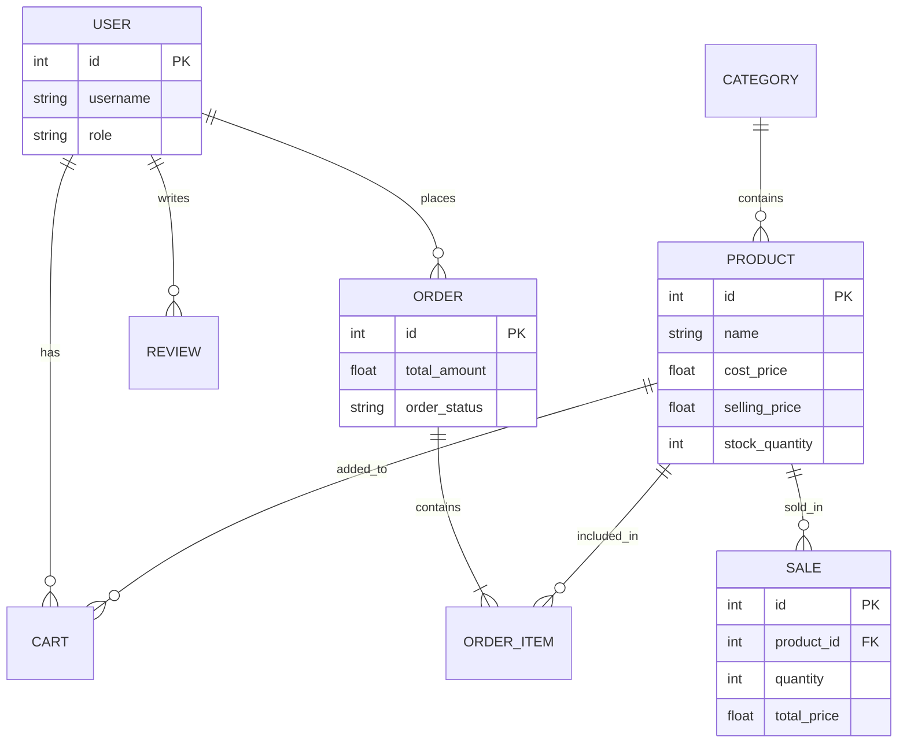

<div align="center">

# 🛒 Jay Goga Kirana Store — E-Commerce & Retail ERP System

<p align="center">
  
  
  
  
  
  
</p>

<p align="center">
  <b>Comprehensive Full-Stack Retail ERP and E-Commerce Platform Featuring Separate Admin ERP and Customer Storefront Portals</b>
</p>

<p align="center">
  
</p>

</div>

---

## 🌟 Overview

**Jay Goga Kirana Store** is an enterprise grocery management and e-commerce web platform built with Python Flask and SQLAlchemy. It bridges retail shop operations with an online storefront — providing shopkeepers with inventory tracking, billing, and sales analytics, while offering customers an intuitive ordering portal.

---

## ✨ Key Capabilities

### 👨‍💼 1. Admin Management ERP
- 📊 **Executive Analytics Dashboard:** Visualizes 1-day, 7-day, and 30-day sales and profit trends with interactive **Chart.js** graphs.
- 📦 **Inventory & Stock Management:** Add/edit products with image uploads, track cost prices vs. selling prices, calculate profit margins, and receive low-stock alerts.
- 🧾 **Point-of-Sale (POS) & Billing:** Record in-store manual sales, automatically deduct stock, and generate printable PDF invoices via **ReportLab**.
- 📋 **Order Fulfillment:** Live order pipeline tracking (Pending → Processing → Shipped → Delivered).
- 📑 **Data Export:** Export transaction history to CSV and PDF formats with date-range filters.

### 🛍️ 2. Customer Storefront
- 🔍 **Interactive Product Catalog:** Category filtering, keyword search, and live price/stock badges.
- 🛒 **Dynamic Shopping Cart:** Real-time quantity adjustments and subtotal calculation.
- 💳 **Seamless Checkout & Tracking:** Shipping address management and simulated payment processing with order tracking.
- ⭐ **Product Reviews:** Customer ratings and feedback system.

---

## 🏗️ Architecture & Database Schema


```mermaid
erDiagram
    USER ||--o{ CART : has
    USER ||--o{ ORDER : places
    USER ||--o{ REVIEW : writes
    CATEGORY ||--o{ PRODUCT : contains
    PRODUCT ||--o{ SALE : sold_in
    PRODUCT ||--o{ CART : added_to
    ORDER ||--|{ ORDER_ITEM : contains
    PRODUCT ||--o{ ORDER_ITEM : included_in

    USER {
        int id PK
        string username
        string role
    }
    PRODUCT {
        int id PK
        string name
        float cost_price
        float selling_price
        int stock_quantity
    }
    ORDER {
        int id PK
        float total_amount
        string order_status
    }
    SALE {
        int id PK
        int product_id FK
        int quantity
        float total_price
    }
```

---

## 📁 Repository Structure

```
mart/
├── app/                        # Application Package
│   ├── routes/                 # Modular Blueprints (admin, customer, auth, security)
│   ├── models.py               # SQLAlchemy Database Models
│   ├── services/               # Cart, Order, and Storage services
│   ├── utils.py                # Analytics, CSV/PDF generation helpers
│   └── templates/              # Jinja2 templates (Admin & Customer layouts)
├── static/                     # CSS, JS, Branding images & product uploads
├── requirements.txt            # Python dependencies
├── config.py                   # App configurations (.env loader)
├── app.py                      # Flask development entry point
└── README.md                   # Project documentation
```

---

## 🚀 Getting Started

### 1. Prerequisites
- Python 3.8+
- `pip`

### 2. Installation & Run
```bash
# Clone the repository
git clone https://github.com/ra901625072-boop/Glossary-Mart.git
cd Glossary-Mart

# Create and activate virtual environment
python -m venv venv
venv\Scripts\activate        # Linux/macOS: source venv/bin/activate

# Install dependencies
pip install -r requirements.txt

# Start Flask server
python app.py
```

Visit `http://localhost:5000` in your web browser.

---

## 👨‍💻 Author

**Akshaysinh Rajput**
- 🌐 Portfolio: [portfolioakshay.in](https://portfolioakshay.in)
- 💼 LinkedIn: [Akshaysinh Rajput](https://www.linkedin.com/in/akshaysinh-rajput-8a575532b/)
- 🐙 GitHub: [@ra901625072-boop](https://github.com/ra901625072-boop)